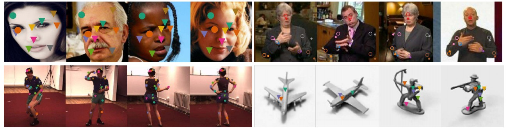

# [Unsupervised Learning of Object Landmarks through Conditional Image Generation](http://www.robots.ox.ac.uk/~vgg/research/unsupervised_landmarks/)

[Tomas Jakab*](http://www.robots.ox.ac.uk/~tomj), [Ankush Gupta*](http://www.robots.ox.ac.uk/~ankush), Hakan Bilen, Andrea Vedaldi (* equal contribution).
Advances in Neural Information Processing Systems (NeurIPS) 2018.

Software that learns to discover object landmarks without any manual annotations.
It automatically learns from images or videos and works across different datasets of faces, humans, and 3D objects.



## Requirements
* Linux
* Python 2.7
* TensorFlow 1.10.0. Other versions (1.\*.\*) are also likely to work
* Torch 0.4.1
* CUDA cuDNN. CPU mode may work but is untested
* Python dependecies listed in `requirements.txt`

## Getting Started

### Installation
Clone this repository
```
git clone https://github.com/tomasjakab/imm && cd imm
```

Install Python dependecies by running
```
pip install --upgrade -r requirements.txt
```

Add the path to this codebase to PYTHONPATH
```
export PYTHONPATH=$PYTHONPATH:$(pwd)
```

### Visualize Unsupervised Landmarks
Download [trained models](http://www.robots.ox.ac.uk/~vgg/research/unsupervised_landmarks/resources/checkpoints.zip) [0.9G] and set the path to them in `configs/paths/default.yaml`, option `logdir`.

Use Jupyter notebook `examples/visualize.ipynb` to run a model trained on AFLW dataset of faces that predicts 10 unsupervised landmarks.


## Test Trained Models
We provide pre-trained models to re-produce the experimental results on facial landmark detection datasets (CelebA, MAFL, and AFLW).
Please download them first as described in *Getting Started/Visualize Unsupervised Landmarks*.

### CelebA and MAFL Datasets
Download [CelebA](http://www.robots.ox.ac.uk/~vgg/research/unsupervised_landmarks/resources/celeba.zip) [7.8G] dataset and set the path to it `configs/paths/default.yaml`, option `celeba_data_dir`.
MAFL dataset is already included in CelebA download.

To test on MAFL dataset run
```
bash examples/test_mafl.sh <N>
```
This loads a model that was trained on CelebA dataset to predict `N` unsupervised landmarks (`N` can be set to 10, 30 or 50). It then trains a linear regressor from unsupervised landmarks to 5 labeled landmarks using MAFL training set and evaluates it on MAFL test set.


### AFLW Dataset
Download [AFLW](http://www.robots.ox.ac.uk/~vgg/research/unsupervised_landmarks/resources/aflw_release-2.zip) [1.1G] dataset and set the path to it `configs/paths/default.yaml`, option `aflw_data_dir`.

To test on AFLW dataset run
```
bash examples/test_aflw.sh <N>
```
This loads a model that was trained on CelebA dataset and finetuned on AFLW dataset to predict `N` unsupervised landmarks (`N` can be set to 10, 30, or 50). It then trains a linear regressor from unsupervised landmarks to 5 labeled landmarks using AFLW training set and evaluates it on AFLW test set.

## Training
If you wish to train your own model, please [download VGG16 model](http://www.robots.ox.ac.uk/~vgg/research/unsupervised_landmarks/resources/vgg16.caffemodel.h5) [0.6G] that was pre-trained on colorization task and is needed for perceptual loss. This model comes from the paper *Colorization as a Proxy Task for Visual Understanding*, Larsson, Maire, Shakhnarovich, CVPR 2017. Set the path to this model in `configs/paths/default.yaml`, option `vgg16_path`. Also download and update the paths to the datasets as described [above](https://github.com/tomasjakab/imm#test-trained-models).

Set the option `logdir` in `configs/paths/default.yaml` to the location where you wish to store training logs and checkpoints.

### CelebA Dataset
To train a model for `N` (e.g., `N` can be 10, 30 or anything else) unsupervised landmarks on CelebA dataset run
```
bash examples/train_celeba.sh <N>
```

### AFLW Dataset
We first train on CelebA as described above, and then fine-tune on AFLW due to its small size.

To finetune a model for `N` unsupervised landmarks on AFLW dataset run
```
bash examples/train_aflw.sh <N> <celeba_checkpoint>
```
where `celeba_checkpoint` is the path to the model checkpoint trained on CelebA. This could be for example `data/logs/celeba-10pts/model.ckpt`.

## Legacy Training and Evaluation Code
Test errors reported in the paper were obtained with a data pipline that was using MATLAB for image pre-processing. This codebase uses a Python re-implementation. Due to numerical differences, the test errors may slightly differ. If you wish to reproduce the exact numbers from the paper contact us at [tomj@robots.ox.ac.uk](mailto:tomj@robots.ox.ac.uk) to get this data pipeline (requires MATLAB).

